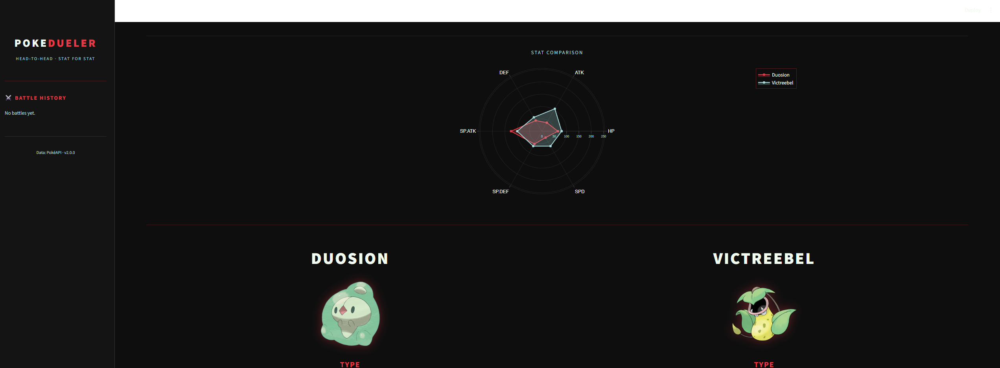
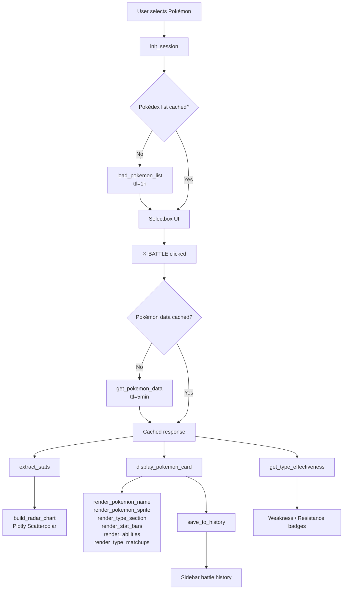

# PokeDueler
**Head-to-Head. Stat for Stat.**

A full-stack Streamlit application for real-time Pokémon base stat comparison, built on
the public PokéAPI. This project demonstrates production-oriented Python application
design — from clean data layer architecture and stateful UI workflows to ML-adjacent
features like type effectiveness modeling and radar chart visualization.

---

## Preview



```
Screenshots/
└── pokedueler_preview.png   ← drag your screenshot here
```

---

## What This Project Demonstrates

- Full-stack Python application design with clean separation of data, logic, and presentation
- API integration with typed exception handling, structured logging, and TTL caching strategy
- Stateful multi-screen UI orchestration using Streamlit session state
- Type effectiveness modeling using a static 18×18 multi-type multiplier system
- Data visualization with interactive Plotly radar chart overlays
- Production-ready patterns: request caching, graceful degradation, fallback rendering
- Pytest test suite with 43 assertions covering game logic and API integration
- GitHub Actions CI for automated testing and type checking

---

## Architecture



---

## Application Structure

```
Pokemon-Battler/
├── app.py               — Main Streamlit entry point (UI, layout, state management)
├── type_chart.py        — Gen VI+ type effectiveness table and matchup calculator
├── pokemon.py           — CLI Pokémon lookup and comparison utility
├── requirements.txt     — Pinned runtime dependencies
├── requirements-dev.txt — Development dependencies (pytest, mypy, black)
├── images/
│   └── pokemon.png      — VS battle banner asset
├── tests/
│   ├── test_type_chart.py — 30 assertions: offensive/defensive/dual-type logic
│   └── test_pokemon.py    — 13 assertions: API fetching, stat calculation, display
└── .github/
    └── workflows/
        └── ci.yml       — GitHub Actions: test + type check on every push
```

> `archive/app_v1.py` contains the original minimal implementation showing the iterative
> development path from basic stat comparison to the full feature set.

---

## Running the App

### Prerequisites

Python 3.11+ and pip.

### Install and Run

```bash
pip install -r requirements.txt
python -m streamlit run app.py
```

Opens at `http://localhost:8501`.

---

## Development

### Run tests

```bash
pip install -r requirements-dev.txt
pytest tests/ -v --cov=. --cov-report=term-missing
```

### Type check

```bash
mypy type_chart.py pokemon.py --ignore-missing-imports
```

### CLI utility

```bash
python pokemon.py
```

---

## Featured Capabilities

**[Autocomplete Pokédex Search](app.py)**\
Fetches all 1,302+ Pokémon names from PokéAPI at startup, cached for 60 minutes via
`st.cache_data`. Rendered as a searchable selectbox — user types to filter inline
without a round-trip.

**[Radar Chart Stat Overlay](app.py)**\
Plotly `Scatterpolar` figure overlaying both Pokémon's six base stats (HP, ATK, DEF,
SP.ATK, SP.DEF, SPD) on the same axes. Transparent background preserves the dark theme.

**[Type Effectiveness Analysis](type_chart.py)**\
`get_type_effectiveness(types)` computes offensive coverage, defensive weaknesses, and
immunities by multiplying incoming type multipliers across dual-type combinations. Uses
the Gen VI+ 18×18 static chart with only non-1× entries stored for efficiency.

**[Random Battle Mode](app.py)**\
🎲 button on each slot uses `on_click` callback to write a random name into session
state before the selectbox re-renders, ensuring correct Streamlit widget sync.

**[Session Battle History](app.py)**\
Last five matchups persisted in `st.session_state.battle_history`. Sidebar renders each
entry with a one-click Rematch button that repopulates both slots and triggers a rerun.

---

## Troubleshooting

| Problem | Cause | Fix |
|---|---|---|
| Blank screen on startup | PokéAPI timeout | Check your internet connection; the app falls back to a text input |
| `'X' not found` error | Misspelled Pokémon name | Use the selectbox autocomplete or check the exact name on PokéAPI |
| Port already in use | Another Streamlit instance running | Run `streamlit run app.py --server.port 8502` |
| Images not loading | Running from wrong directory | `cd` into `Pokemon-Battler/` before running |

---

## Tools & Stack

| Capability | Tools | Example |
|---|---|---|
| Web UI Framework | Streamlit | `app.py` — session state, layout, CSS injection |
| HTTP Client | requests | `get_pokemon_data()`, `load_pokemon_list()` |
| Data Visualization | Plotly (`graph_objects`) | `build_radar_chart()` — Scatterpolar overlay |
| Caching | `st.cache_data` (TTL) | 60-min name list, 5-min per-Pokémon data |
| Type Modeling | Static dict + combinatorial logic | `type_chart.py` — `get_type_effectiveness()` |
| UI Theming | Custom CSS via `st.markdown` | Midnight Crimson design system |
| API | PokéAPI v2 | `/pokemon?limit=1302`, `/pokemon/{name}` |
| Testing | pytest + responses | 43 assertions, mocked HTTP |
| Type Checking | mypy | `type_chart.py`, `pokemon.py` |
| CI | GitHub Actions | Test + type check on push |

---

## Design Principles

- **Cached at the boundary:** all PokéAPI calls go through two `@st.cache_data` functions;
  no raw `requests.get` calls elsewhere in the codebase
- **Typed exception handling:** `requests.HTTPError`, `requests.Timeout`, and
  `requests.RequestException` are caught separately with structured logging — no bare `except`
- **Graceful degradation:** if the name list fails to load, the app falls back to a text
  input; if the VS banner image is absent, a pure-CSS fallback renders instead
- **Single-responsibility functions:** `display_pokemon_card` is split into
  `render_pokemon_name`, `render_pokemon_sprite`, `render_type_section`, `render_stat_bars`,
  `render_abilities`, and `render_type_matchups` — each independently testable
- **Session state discipline:** widget values and application state are managed through
  explicit session keys with a central `init_session()` initializer
